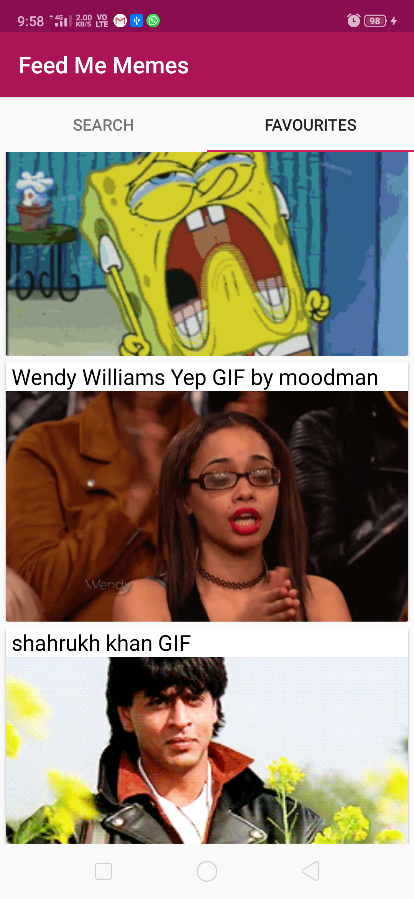
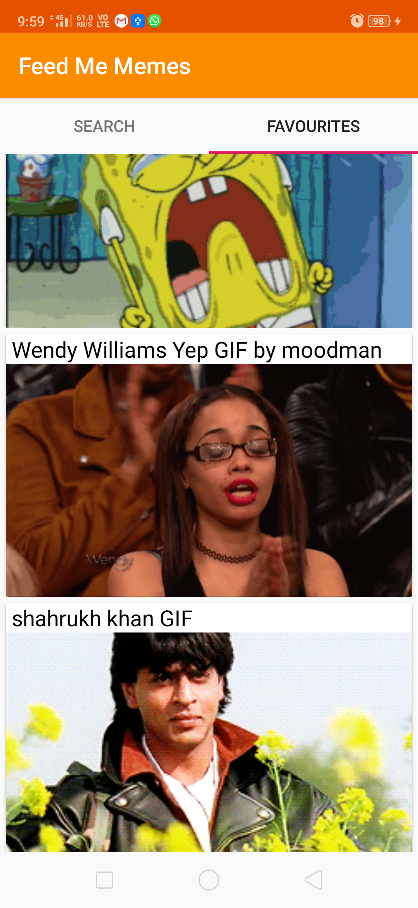
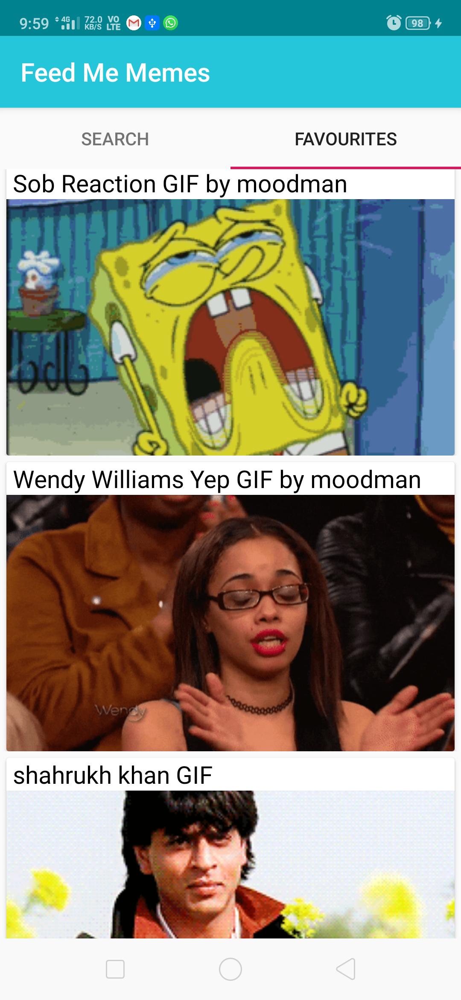
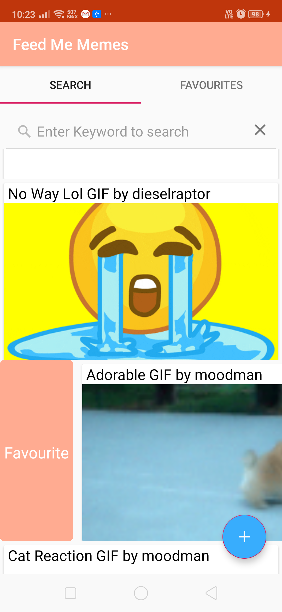
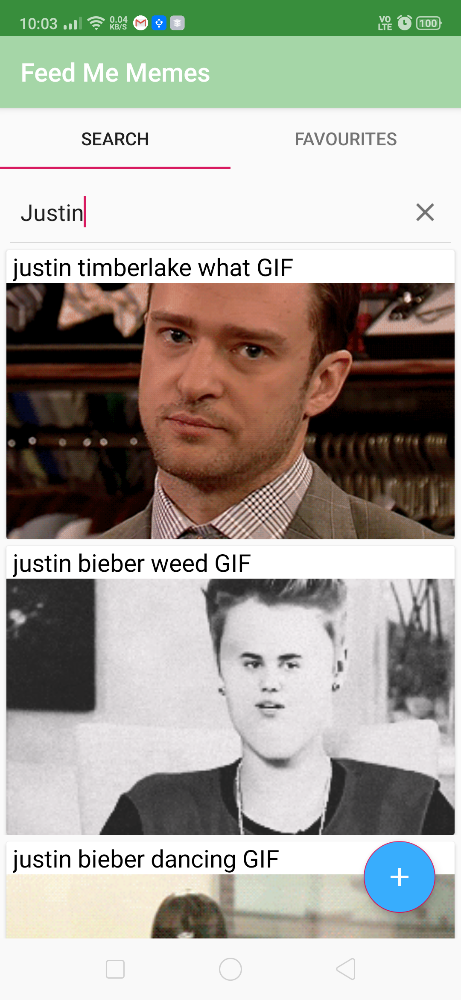
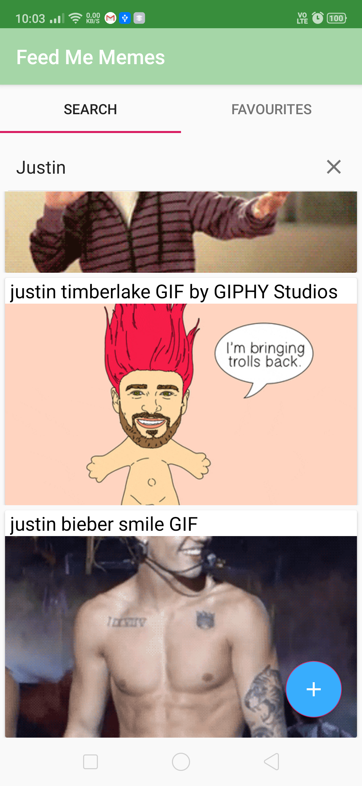

# feedMeMemes
An android App that show you best of all time memes and make your own memes and share them to show your sense of humor and creativity

# Technical Features
1. Room database implemented so that application can work without internet
2. Clean architecture with MVVM architecture and best practices implemented
3. Clean and asthetic appealing UI
4. Share your memes on social platforms
5. Dynamic UI and theme changes, like status and app bar color changes as per day, or even with the contents viewed, or per 30 minutes
6. Save your memes in local storage
7. Scroll unlimited to get more and more memes
8. Optimal Caching usage 

# Screenshots
<h1>Dynamic Theming </h1>

 
<h1>Add your favourite meme</h1>

 
<h1>Search your favourite memes </h1>

## Credits
1. 

## Database debugging
To debug the Database, when url is printed  in logs, use command - adb forward tcp:8080 tcp:8080, make sure that android app if on hardware phone, and developing machine on same platform

## Issues
1. Make button view gone in rv button when clicked in swipe left
6. Shared prefs with dagger
10. Debug it and see the flow, what is going wrong
11. First item is inserted twice, and some more issues
